# Aegis — Confidential Data Guard for AI Agents

**Aegis is a local Data-Loss-Prevention (DLP) layer that strips confidential company data out
of requests to AI agents (Claude Code, Cursor, Cline, ChatGPT, custom scripts) before they
ever leave the machine, then restores the real values in the response so the developer never
notices.**

> Detection runs entirely on the local machine. No API key is required and no data is ever
> sent to any AI to "check" it. Aegis never reads or stores your agent's API key — it only
> forwards it.

```
   employee's agent                Aegis (localhost)                 AI provider
  +----------------+    request   +------------------+  scrubbed   +--------------+
  |  Claude Code   | -----------> |  detect + redact  | ----------> | api.anthropic |
  |  Cursor / etc. | <----------- |  restore on reply | <---------- |   .com / ...  |
  +----------------+   response   +------------------+   response  +--------------+
                                   real values never cross this line ^
```

---

## Table of contents

- [The problem](#the-problem)
- [Why this beats git-secrets / gitleaks / GitGuardian](#why-this-beats-git-secrets--gitleaks--gitguardian)
- [Interception modes](#interception-modes)
- [Architecture](#architecture)
- [Core engine — UML class diagram](#core-engine--uml-class-diagram)
- [Request lifecycle (sequence)](#request-lifecycle-sequence)
- [Redact / restore decision (flowchart)](#redact--restore-decision-flowchart)
- [Detection pipeline](#detection-pipeline)
- [System proxy and transparent interception](#system-proxy-and-transparent-interception)
- [Prerequisites](#prerequisites)
- [Install and build](#install-and-build)
- [Running Aegis](#running-aegis)
- [CLI commands](#cli-commands)
- [Configuration](#configuration)
- [VS Code extension](#vs-code-extension)
- [Checking status](#checking-status)
- [Security and privacy](#security-and-privacy)
- [Project structure](#project-structure)
- [Testing](#testing)
- [Roadmap](#roadmap)

---

## The problem

Developers paste `.env` files, config, logs, and proprietary code into AI agents every day.
Tools like git-secrets and gitleaks only scan *commits* — they do nothing about the real leak
path: **the request to the model**. By the time code reaches a commit, it has often already
been sent to a third-party LLM.

Aegis guards exactly that boundary.

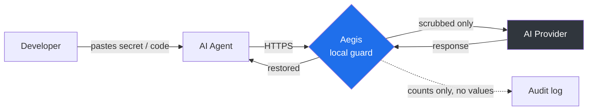

---

## Why this beats git-secrets / gitleaks / GitGuardian

| | git-secrets / gitleaks | GitGuardian | Aegis |
|---|:--:|:--:|:--:|
| Catches secrets at **commit** time | Yes | Yes | Yes (`aegis scan` in pre-commit/CI) |
| Catches data pasted into **AI agents** | No | No | Yes |
| Works across **any** agent (not one editor) | No | No | Yes (API + OS level) |
| **Restores** values so the workflow isn't broken | n/a | n/a | Yes |
| Custom company dictionary (codenames, customers) | Partial | Partial | Yes (first-class) |
| Confidential **source-code** markers / namespaces | No | No | Yes |
| Runs fully **offline**, never phones home | Yes | No (SaaS) | Yes |
| Needs **no API key**, makes no AI calls | Yes | No | Yes |

---

## Interception modes

Four ways for traffic to reach the guard — all sharing one offline detection engine.

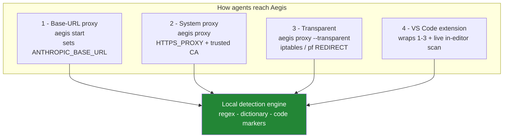

| Mode | Agents reached | Setup cost | OS |
|---|---|---|---|
| **Base-URL proxy** | any agent that reads `*_BASE_URL` | trivial | all |
| **System proxy** | anything honoring `HTTPS_PROXY` + the CA | install a root CA once | all |
| **Transparent** | any app, even hardcoded endpoints | iptables/pf rule (root) | Linux + macOS |
| **VS Code extension** | editor + terminals (wraps the above) | install the `.vsix` | all |

---

## Architecture

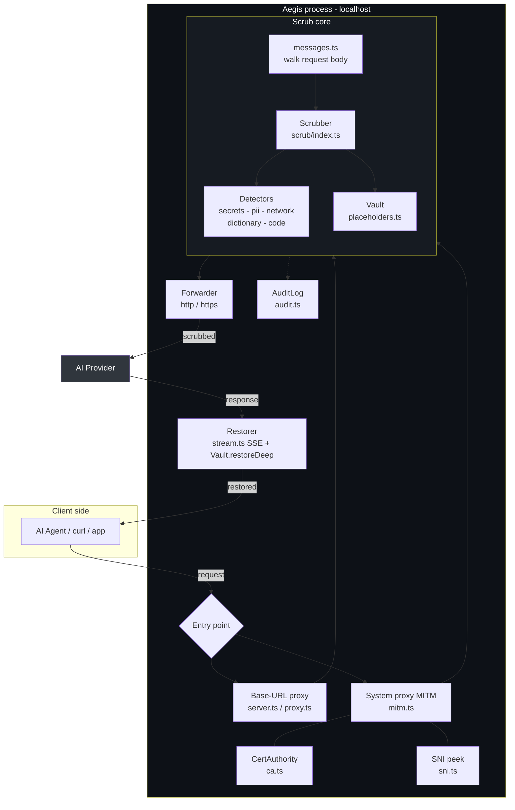

---

## Core engine — UML class diagram

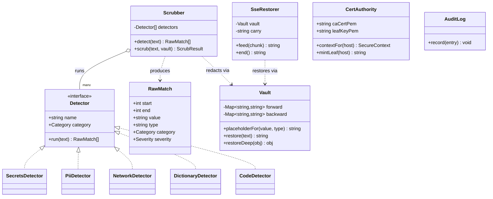

> The detectors are pure functions over text. Adding a new category is one file implementing
> the `Detector` interface in [`src/scrub/detectors/`](src/scrub/detectors/).

---

## Request lifecycle (sequence)

The redact, forward, and restore round trip, including streaming responses:

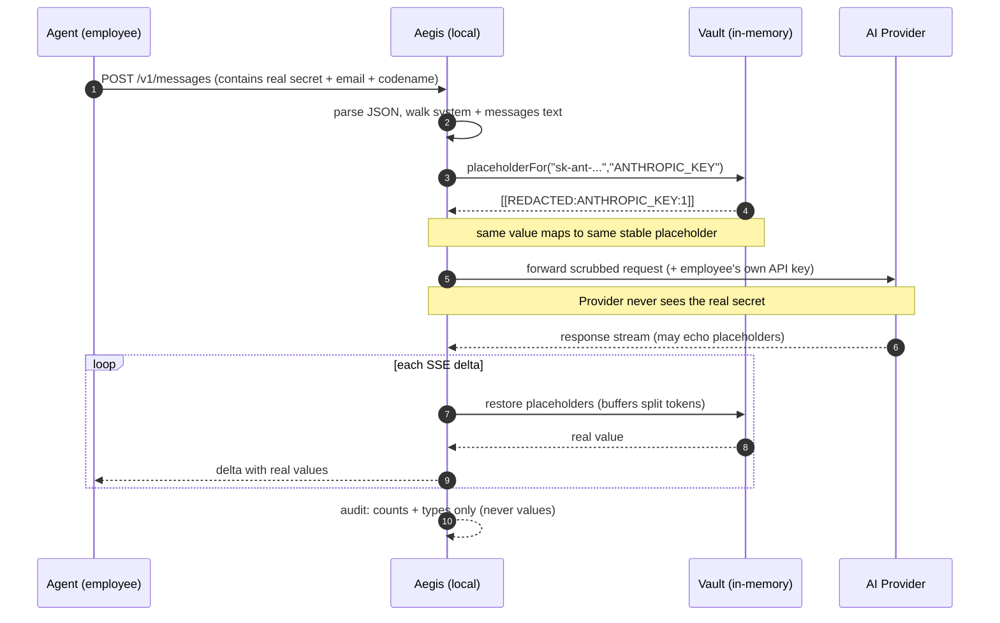

---

## Redact / restore decision (flowchart)

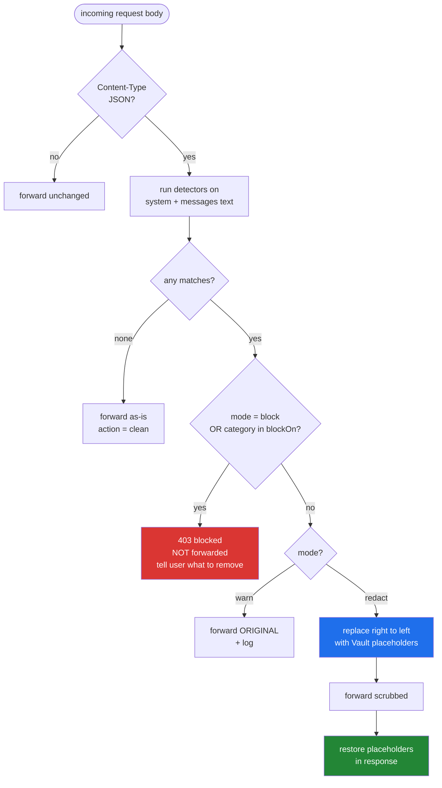

---

## Detection pipeline

Every text field runs through all enabled detectors; overlapping hits are resolved
(earliest, then longest wins) before replacement.

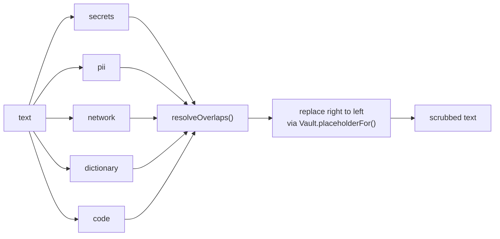

**Built-in detectors**

| Category | Examples |
|---|---|
| `secret` | AWS / GCP / Anthropic / OpenAI keys, GitHub tokens, Slack/Stripe/SendGrid/Twilio/npm tokens, JWTs, PEM private keys, DB-URI passwords, generic `password=` / `secret=` |
| `pii` | emails, phone numbers, SSNs, Luhn-validated credit cards |
| `network` | IPv4 addresses, internal hostnames (`*.internal`, `*.corp`, `*.svc.cluster.local`) |
| `dictionary` | your codenames, customer names, internal domains (configured) |
| `code` | `CONFIDENTIAL` / `PROPRIETARY` markers, internal package namespaces |

---

## System proxy and transparent interception

### System proxy (CONNECT + locally-trusted CA)

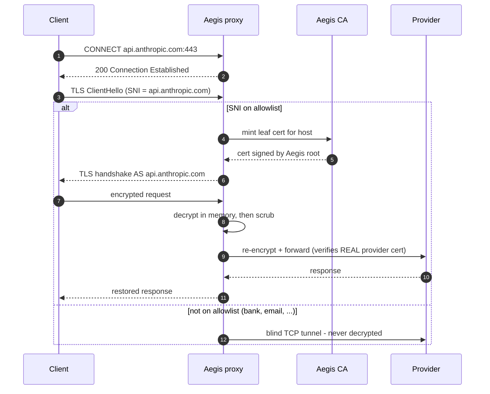

### Transparent mode (OS-level redirect)

For apps that ignore `HTTPS_PROXY`, redirect at the packet level and route by SNI:

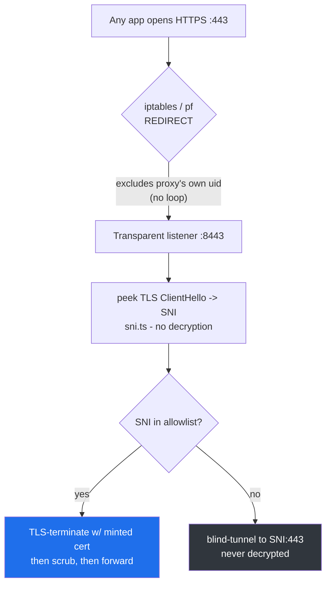

> **Loop avoidance:** the redirect rule excludes the proxy's own uid (`! --uid-owner` on Linux,
> `no rdr ... user` on macOS), so the proxy's *forward* connections are not redirected back into
> itself. Run the proxy as a dedicated user and pass its uid.

---

## Prerequisites

- **Node.js >= 18.17** (`node --version`). Uses the built-in global `fetch` and web streams.
- **npm** (ships with Node).
- For **transparent mode** only: Linux with `iptables`, or macOS with `pfctl` — and `sudo`.
- No API key, account, or network access is needed to run or test Aegis.

---

## Install and build

```bash
git clone <repo-url>
cd B2B
npm install        # installs deps (node-forge for certificates; dev: typescript, vitest, tsx)
npm run build      # compiles TypeScript to dist/
npm test           # runs the 31-test suite (optional but recommended)
```

After `npm run build`, the CLI entry point is `dist/cli.js`. Run it with `node dist/cli.js <command>`.
During development you can skip the build step and run from source with `npx tsx src/cli.ts <command>`.

Show all commands:

```bash
node dist/cli.js help
```

---

## Running Aegis

Pick the mode that matches how broadly you need to cover agents. All modes use the same
detection engine and the same `aegis.config.json`.

### Mode 1 — Base-URL proxy (simplest, recommended to start)

Best for agents that read `ANTHROPIC_BASE_URL` / `OPENAI_BASE_URL` (Claude Code, OpenAI SDKs, most CLIs).

```bash
# 1. Start the proxy (foreground; Ctrl-C to stop)
node dist/cli.js start
# -> Aegis DLP guard listening on http://127.0.0.1:8787

# 2. In the shell that runs your agent, point it at the proxy
export ANTHROPIC_BASE_URL=http://127.0.0.1:8787
export OPENAI_BASE_URL=http://127.0.0.1:8787/v1

# 3. Run your agent normally — requests are now scrubbed automatically
claude            # or cursor, or your own script
```

To make every new terminal route through Aegis automatically (writes a clearly-marked,
reversible block to your shell profile):

```bash
node dist/cli.js setup           # enable for all terminals
node dist/cli.js setup --undo    # remove it
```

### Mode 2 — System proxy (covers any HTTPS_PROXY-aware app)

```bash
# 1. One time: generate and trust the root CA (prints OS-specific instructions)
node dist/cli.js ca
#    Node agents can skip the OS install: export NODE_EXTRA_CA_CERTS=~/.aegis/ca.crt

# 2. Start the HTTPS-intercepting proxy (foreground)
node dist/cli.js proxy
# -> Aegis system proxy on http://127.0.0.1:8788

# 3. Route apps through it
export HTTPS_PROXY=http://127.0.0.1:8788
export HTTP_PROXY=http://127.0.0.1:8788
```

Only allowlisted AI hosts are decrypted; all other traffic is blind-tunnelled and never read.

### Mode 3 — Transparent (catches apps that ignore proxy settings; Linux/macOS)

```bash
# 1. Run the proxy (and its transparent listener) as a dedicated user
sudo -u aegis node dist/cli.js proxy --transparent

# 2. Print the redirect rules (review them), or apply directly as root
node dist/cli.js transparent --uid "$(id -u aegis)"            # prints iptables (Linux) / pf (macOS)
sudo node dist/cli.js transparent --apply --uid "$(id -u aegis)"   # Linux: applies them

# Undo later
sudo node dist/cli.js transparent --undo --apply --uid "$(id -u aegis)"
```

### Run in the background (optional)

```bash
node dist/cli.js start > aegis.log 2>&1 &     # start detached, logs to aegis.log
node dist/cli.js status                       # confirm it is up
kill %1                                        # stop it
```

### Verify it is working

```bash
# In another terminal, confirm the guard is live
node dist/cli.js status
curl http://127.0.0.1:8787/__aegis/health      # -> {"status":"ok",...}

# Confirm scrubbing without any AI: scan a file for confidential data
node dist/cli.js scan path/to/file.env
```

---

## CLI commands

```text
aegis start       Base-URL proxy. Agents set ANTHROPIC_BASE_URL/OPENAI_BASE_URL to it.
aegis proxy       System proxy (HTTPS interception). Add --transparent for OS-level capture.
aegis transparent Print (or --apply as root) the iptables/pf REDIRECT rules.
aegis status      Check whether the guard is running (probes all ports).
aegis ca          Show / export the root CA and OS trust instructions.
aegis setup       Auto-route ALL terminals through the base-URL guard ( --undo to revert ).
aegis scan        Scan a file (or stdin) for findings; exits non-zero so it gates CI/pre-commit.
aegis init        Write a starter aegis.config.json.
```

Common flags: `--config <path>`, `--port <n>`, `--mode redact|block|warn` (start),
`--transparent` (proxy), `--uid <uid> --apply --undo --platform linux|darwin` (transparent),
`--export <path>` (ca), `--undo` (setup).

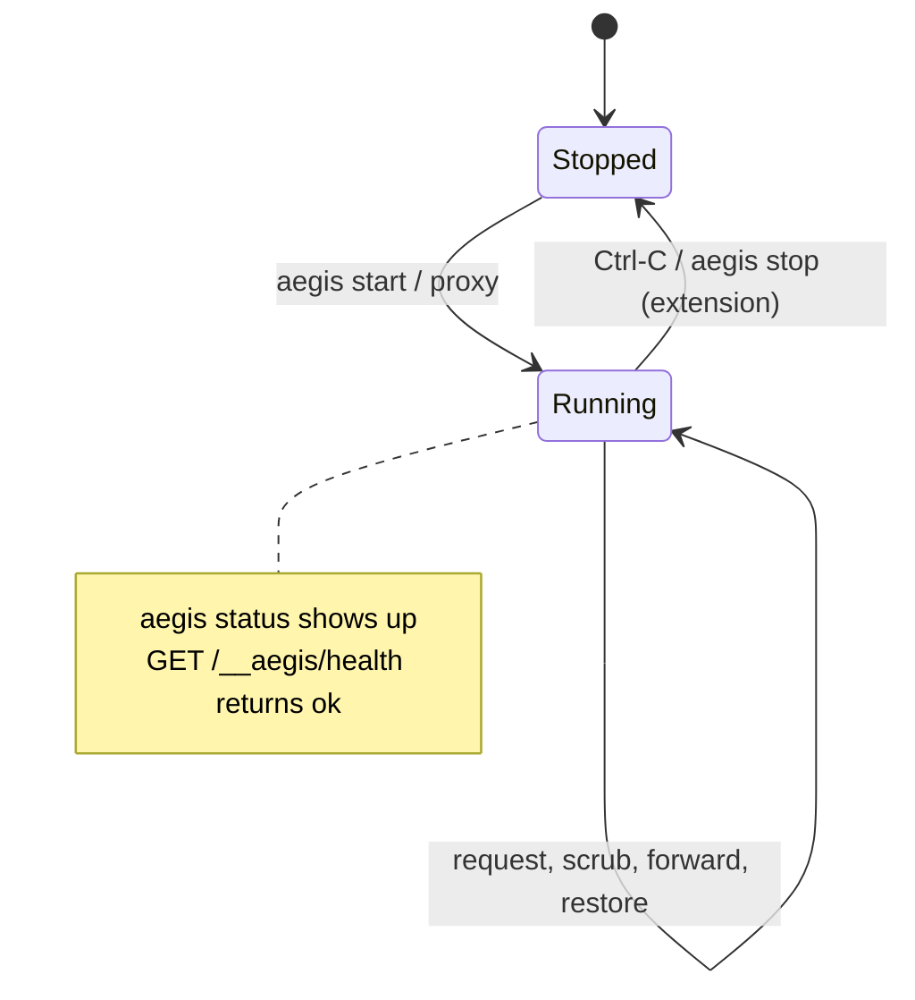

---

## Configuration

`aegis.config.json` (see [`aegis.config.example.json`](aegis.config.example.json)). If absent,
sensible defaults are used. Generate one with `node dist/cli.js init`.

```jsonc
{
  "port": 8787,
  "host": "127.0.0.1",

  "mode": "redact",            // redact | block | warn
  "blockOn": ["secret"],       // categories that hard-block regardless of mode

  "detectors": {
    "secrets": true, "pii": true, "network": true,
    "dictionary": true, "code": true
  },

  "dictionary": ["Project Phoenix", "acme-internal.com", "BigCustomer Inc"],
  "code": {
    "markers": ["CONFIDENTIAL", "PROPRIETARY", "INTERNAL USE ONLY"],
    "internalNamespaces": ["com.acme.internal", "@acme/internal"]
  },

  "routes": [
    { "matchPrefix": "/v1/messages",         "upstream": "https://api.anthropic.com", "format": "anthropic" },
    { "matchPrefix": "/v1/chat/completions", "upstream": "https://api.openai.com",    "format": "openai" }
  ],

  "mitm": { "port": 8788, "transparentPort": 8443, "hosts": ["api.anthropic.com", "api.openai.com"] },
  "auditLog": "./aegis-audit.log"
}
```

Environment overrides: `AEGIS_PORT`, `AEGIS_HOST`, `AEGIS_MODE`, `AEGIS_HOME` (CA directory).

---

## VS Code extension

The extension ([`extension/`](extension/)) is the developer-facing front-end. It runs the guard
in-process and adds live in-editor protection.

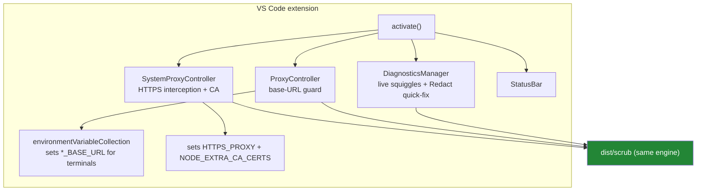

**Build and install:**

```bash
cd extension
npm install
npm run package                                  # produces aegis-guard-0.1.0.vsix
code --install-extension aegis-guard-0.1.0.vsix
```

**Develop (Extension Development Host):** open the repo in VS Code and press `F5` — the launch
config builds and launches the extension.

**Commands:** Start/Stop Guard Proxy, Start/Stop System Proxy, Show CA Trust Instructions,
Protect All Terminals, Scan File / Workspace, Redact Selection, Copy as Redacted, Show Activity Log.

---

## Checking status

```bash
node dist/cli.js status
```

```text
Aegis status

  up    base-URL proxy         127.0.0.1:8787   (mode=redact)
  down  system proxy           127.0.0.1:8788
  down  transparent listener   127.0.0.1:8443

Aegis is running.
```

Exits `0` if anything is up, `1` if nothing is. Other checks:

| Check | Command |
|---|---|
| Health endpoint | `curl http://127.0.0.1:8787/__aegis/health` |
| Port listening | `ss -ltn \| grep -E ':8787\|:8788\|:8443'` |
| Process alive | `pgrep -af "dist/cli.js"` |
| Live activity | `tail -f aegis-audit.log` |

In the extension, the Aegis status-bar item shows `Guard on` / `Guard off`.

---

## Security and privacy

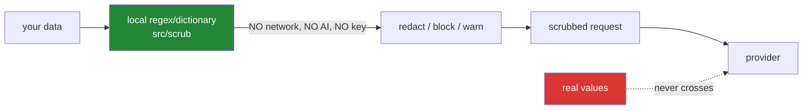

- **No API key, no AI calls for detection.** The engine in [`src/scrub/`](src/scrub/) is pure
  local matching. Sending data to an AI to check it would defeat the purpose; Aegis never does.
- **Your agent's key is only forwarded** — never read, stored, or logged.
- **Ephemeral vault.** The redact/restore mapping lives in memory for a single request, then is
  discarded. Real values are never written to disk.
- **Audit log records counts and types only**, safe to ship to a SIEM.
- **MITM decrypts only allowlisted AI hosts**; everything else is blind-tunnelled. The root CA's
  private key never leaves the machine.
- **Only runtime dependency:** `node-forge` (X.509 certificates). No AI SDK.

---

## Project structure

```
src/
  cli.ts            commands: start, proxy, transparent, status, ca, setup, scan, init
  config.ts         config loader + DEFAULT_CONFIG
  types.ts          shared types
  server.ts         base-URL proxy bootstrap
  proxy.ts          base-URL request handling (scrub, forward, restore) + /__aegis/health
  messages.ts       Anthropic/OpenAI body walkers
  stream.ts         SSE streaming restorer (handles split placeholders)
  audit.ts          append-only audit (counts only)
  status.ts         liveness probes for `aegis status`
  mitm.ts           system proxy: CONNECT + transparent listener (SNI-routed)
  ca.ts             CertAuthority: root CA + per-host leaf certs
  sni.ts            TLS ClientHello SNI extractor
  transparent.ts    iptables (Linux) / pf (macOS) rule generation
  scrub/
    index.ts        Scrubber, resolveOverlaps, summarize
    placeholders.ts Vault (ephemeral redact/restore map)
    detectors/      secrets, pii, network, dictionary, code, util
extension/          VS Code extension (wraps the engine)
test/               31 tests: detectors, roundtrip, stream, ca, mitm, sni
```

---

## Testing

```bash
npm test          # all suites
npm run test:watch
```

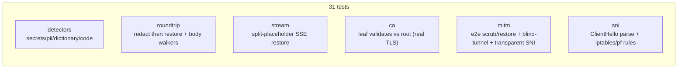

Verified end-to-end: the provider receives only placeholders; the client gets real values
restored (even across split stream chunks); minted leaf certs validate against the root over
real TLS; non-AI hosts are never decrypted.

---

## Roadmap

- Local NER model for unstructured PII (names, addresses), still fully offline.
- Per-route and per-category action overrides.
- Entropy-based detector for novel, un-templated secrets.
- Windows WFP transparent redirection (Linux + macOS already supported).
- Admin dashboard over the audit log.

---

Built as a defense-in-depth guard. Pattern-based detection catches the overwhelming majority of
structured secrets and configured terms, but is not a substitute for keeping real production
secrets off developer machines.
